# Car sharing application
This application is supposed to be used for renting cars.
Admin users have rights to upload information about cars and normal users can take cars for rent.
Application contains payment mechanism and telegram bot to report admin about main operations.

## Technologies
The application was made with technologies:
1. Spring Boot, 3.3.3
2. Spring Security
3. Spring Data JPA
4. Hibernate
5. Liquibase
6. Json Web token, "jjwt-api" 0.12.0
7. Lombok, "lombok" 0.2.0
8. Mapstruct, "mapstruct-processor" 1.5.5.Final
9. Test containers, "junit-jupiter" 1.18.0
10. Springdoc, "springdoc-openapi-starter-webmvc-ui" 2.6.0
11. Docker, "docker compose" 2.3.3
12. Stripe (
    https://docs.stripe.com/get-started,
    https://github.com/stripe/stripe-java,
    https://docs.stripe.com/api/checkout/sessions/create
    )
13. "stripe-java", 26.0.0
14. Telegram bots, "telegrambots-spring-boot-starter" 6.7.0

## Controllers
There are controllers:
1. AuthenticationController. This controller provides the way of registration of user and signing in of registered user.
2. UserController. This controller contains methods to get and update user data.
3. CarController. Contains methods to get, add, update and delete information about cars for renting.
4. RentalController. Contains methods related to rental operations: taking for rent, return cars, fetching information
   about rented cars.
5. PaymentController. Contains methods related to making payments: creating stripe session, handling results of
   payment operations.

## Launch the project locally
Pre-conditions:

You should have installed: Java (better not less than 17 version).

Nice to have IntelliJIdea for work. You have to add '.env' file and define values for environment variables
in according to the template in the '.env.sample' file.

You have to define secrets as well for Stripe and Telegram bot. Pay attention that we have values for development and
production.

Pay attention on the file 'application.properties' for tests - it contains hardcoded values they should be updated if you
update respective values for the development environment variables in the .env file
- otherwise tests in the GitHub will fall.

For launching in "Docker" you should install "Docker" and "docker compose".

The value of the Telegram token is passed into 'docker-compose.yml' file and to the AWS server.
Pay attention that in case when you make commit to the GitHub - you will probably have to regenerate Telegram token in
the Telegram bot. And because of this reason don't update token that was passed to the AWS in order not to break
Telegram bot in the production. You can create one more test Telegram bot for Docker container if want to check its
flow there.

Before launch the command to run the docker container you should have the Docker running/open.

### Below you can find diagram to run the project in the Docker container:

### Video instruction to run the app:

## Project features
This project is run with the Dockerfile and docker compose.
Except normal controllers,services and repositories this project contains: logic to invoke functions in according to
schedule, custom validations, custom error handling, custom repository methods.
